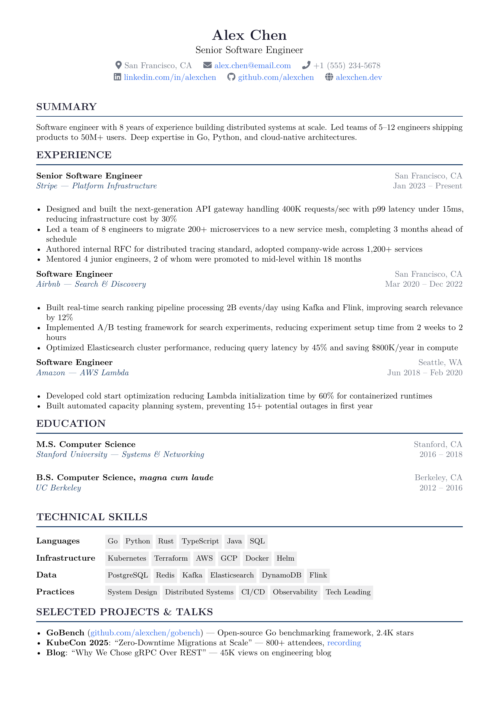
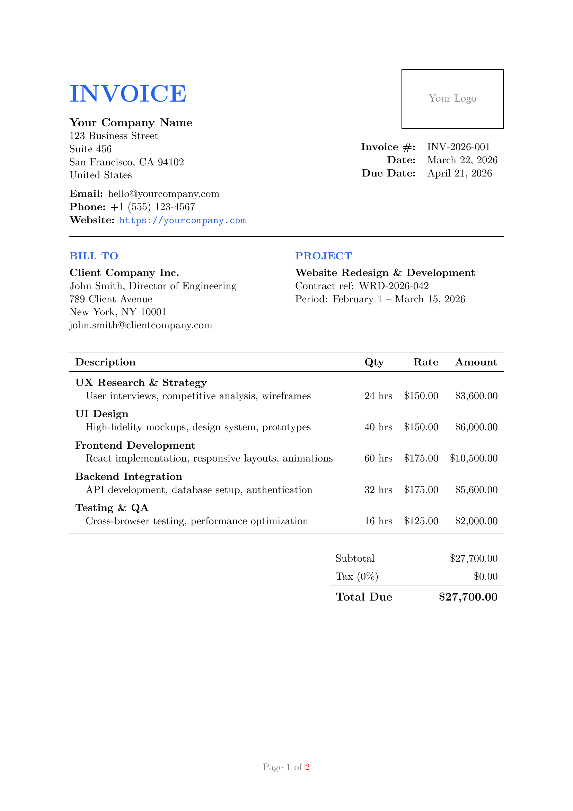
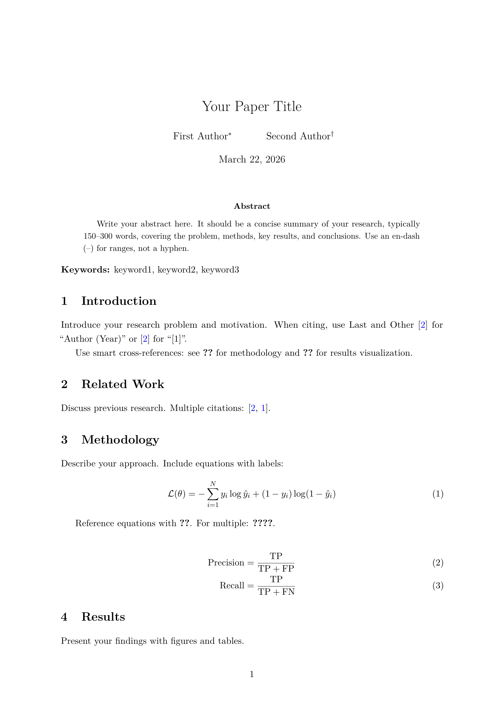
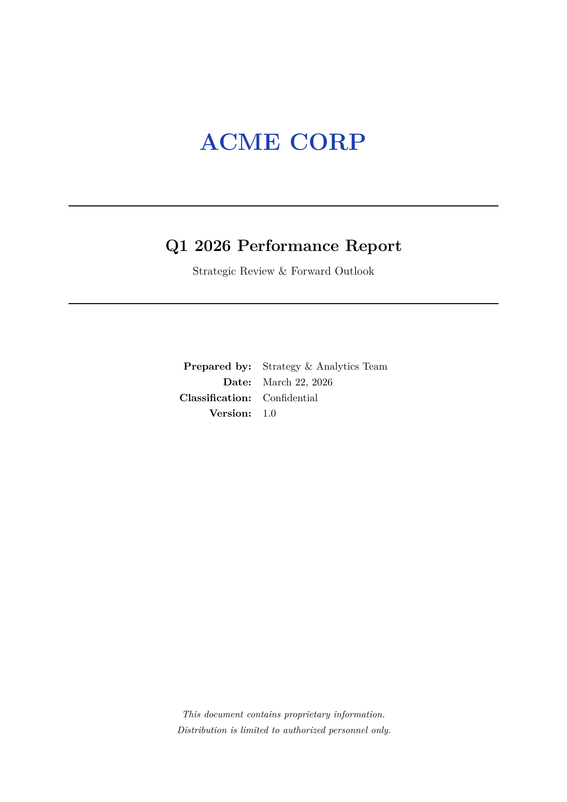
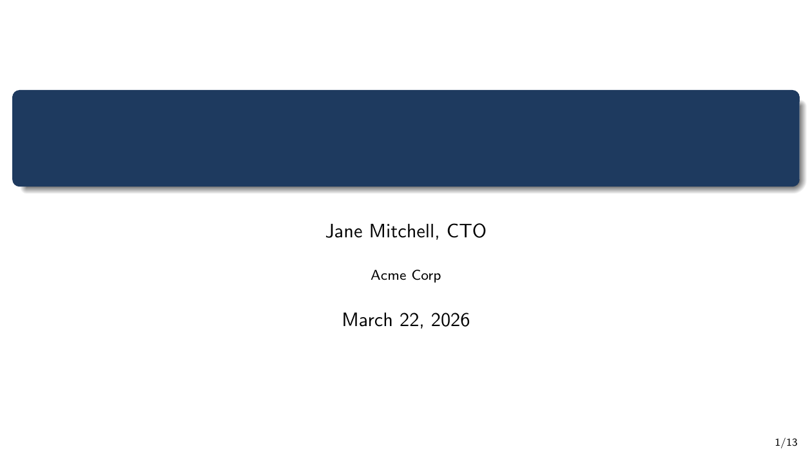
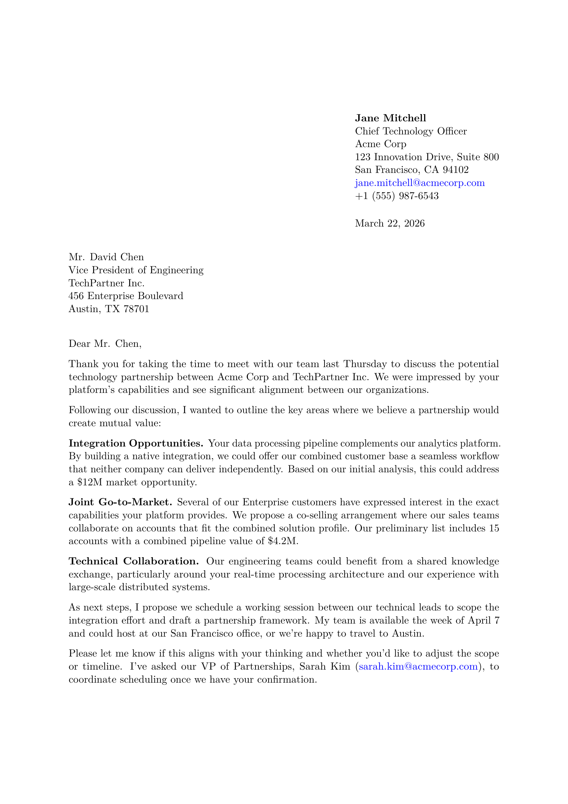

# pdflatex-skill

[](LICENSE)
[](https://docs.anthropic.com/en/docs/claude-code)
[](https://tug.org/texlive/)
[](#)
[](#)
[](#)

A [Claude Code](https://docs.anthropic.com/en/docs/claude-code) skill for creating publication-quality PDF documents using LaTeX. Describe what you want in plain English — Claude writes the LaTeX, compiles it, and hands you the PDF. No LaTeX knowledge required.

Invoices, reports, CVs, presentations, academic papers, letters, contracts, certificates — anything you'd normally fight Word formatting for.

## Template Previews

| CV | Invoice | Research Paper |
|:---:|:---:|:---:|
|  |  |  |

| Report | Presentation | Letter |
|:---:|:---:|:---:|
|  |  |  |

## Installation

### macOS (recommended)

```bash
# 1. Install LaTeX
brew install --cask mactex-no-gui
# or lighter: brew install basictex

# 2. Install the skill
git clone https://github.com/b1rd33/pdflatex-skill.git ~/.claude/skills/pdflatex

# 3. Done — use /pdflatex in Claude Code
```

> **Using BasicTeX?** You may need to install extra packages as you go:
> ```bash
> sudo tlmgr update --self
> sudo tlmgr install collection-fontsrecommended booktabs siunitx enumitem fontawesome5
> ```
> MacTeX Full includes everything — no extra installs needed.

### Linux

```bash
# Debian/Ubuntu
sudo apt install -y texlive-full

# Fedora
sudo dnf install texlive-scheme-full

# Install the skill
git clone https://github.com/b1rd33/pdflatex-skill.git ~/.claude/skills/pdflatex
```

### Windows (WSL recommended)

```bash
# Option A: WSL (best experience)
# 1. Install WSL if not already: wsl --install
# 2. Inside WSL:
sudo apt update && sudo apt install -y texlive-full
git clone https://github.com/b1rd33/pdflatex-skill.git ~/.claude/skills/pdflatex

# Option B: Native Windows (MiKTeX)
# 1. Install MiKTeX from https://miktex.org/download
# 2. Install Claude Code for Windows
# 3. Clone the skill:
#    git clone https://github.com/b1rd33/pdflatex-skill.git %USERPROFILE%\.claude\skills\pdflatex
#
# Note: WSL is the recommended path. Native Windows has not been tested —
# if you hit issues with path separators or shell scripts, switch to WSL.
```

### Project-level install (optional)

To make the skill available only within a specific project:

```bash
git clone https://github.com/b1rd33/pdflatex-skill.git .claude/skills/pdflatex
```

### Verify installation

```bash
# Check LaTeX is available
pdflatex --version
latexmk --version

# Check the skill is in place
ls ~/.claude/skills/pdflatex/SKILL.md
```

## Usage

Open Claude Code and describe what you want. The skill activates automatically when you mention LaTeX, documents, or any of the supported document types.

### Examples you can try right now

**Create documents from scratch:**
```
/pdflatex make me a professional invoice for consulting work — 3 line items, company logo placeholder, payment terms
```
```
/pdflatex create a 10-page research report template with table of contents and bibliography
```
```
/pdflatex build a modern CV for a software engineer — single page, clean layout, ATS-friendly
```
```
/pdflatex make a beamer presentation about Q1 results, 12 slides, modern theme
```
```
/pdflatex write a formal business letter declining a partnership proposal
```

**Work with existing files:**
```
/pdflatex compile this .tex file and fix any errors
```
```
/pdflatex add a bibliography to my paper using biblatex and biber
```
```
/pdflatex convert my paper to PDF/A format for thesis submission
```
```
/pdflatex generate a revision diff between the submitted and current version of my paper
```

**Academic workflows:**
```
/pdflatex set up a new research paper project with ACM template, biber bibliography, and latexmk automation
```
```
/pdflatex format this paper for IEEE Transactions submission
```

## What can it produce?

| Category | Examples |
|----------|---------|
| **Business** | Invoices, proposals, contracts, NDAs, memos, reports |
| **Professional** | CVs/resumes, cover letters, formal letters |
| **Academic** | Research papers, theses, dissertations, journal articles, conference papers |
| **Presentations** | Beamer slide decks, lecture notes, posters |
| **Other** | Certificates, books, cheat sheets, documentation |

## Why LaTeX instead of Word?

If you've ever spent 20 minutes fighting Word's auto-formatting, page breaks, or numbered lists — LaTeX solves that permanently. Here's why professionals use it:

**Publication-quality typesetting.** LaTeX was built by computer scientists who cared obsessively about how text looks on a page. The same system typesets papers in Nature, IEEE, and ACM. Your documents look like they came from a professional print shop.

**Consistency without effort.** Define your style once — every heading, margin, caption, and page number follows the rules automatically. No more "why does page 7 look different from page 3."

**Math, tables, citations just work.** Numbered equations, cross-references that update themselves, bibliographies that format correctly for any journal. Things that are painful in Word are trivial in LaTeX.

**Version control friendly.** LaTeX files are plain text. You can track changes with git, diff revisions, collaborate with pull requests. Try that with a .docx file.

**Free and open source.** No Microsoft license. Works on every operating system. Your documents will compile identically in 20 years.

**With Claude Code + this skill, you never touch LaTeX syntax.** You describe what you want in plain English. Claude writes the LaTeX, picks the right packages, handles compilation, fixes errors, and gives you a PDF. It's like having a professional typesetter who works instantly for free.

## What's inside

```
pdflatex-skill/
├── SKILL.md               # The skill file (loaded by Claude Code)
├── references/             # Detailed reference docs
│   ├── packages.md         # Package reference (40+ packages)
│   ├── cross-references.md # Smart refs with cleveref
│   ├── tables-siunitx.md   # Publication-quality tables
│   ├── latexmk-config.md   # Build automation
│   ├── journal-submission.md # ACM, IEEE, Springer, Elsevier
│   ├── version-control.md  # Git + latexdiff for revisions
│   ├── pdfa-archival.md    # PDF/A for thesis submission
│   ├── fonts.md            # Font guide (all engines)
│   └── troubleshooting.md  # Common errors and fixes
├── scripts/
│   ├── compile_latex.sh    # Multi-engine compilation
│   ├── clean_latex.sh      # Remove auxiliary files
│   └── preview_pdf.sh      # Open PDF (macOS/Linux/WSL)
└── examples/               # Ready-to-compile templates
    ├── research-paper.tex  # Academic paper with bibliography
    ├── references.bib      # Example bibliography file
    ├── invoice.tex         # Professional invoice
    ├── report.tex          # Business report with TOC
    ├── letter.tex          # Formal business letter
    ├── presentation.tex    # Beamer slide deck
    ├── cv.tex              # Modern CV/resume
    └── .latexmkrc          # Build configuration template
```

### Engine support

| Engine | Use case |
|--------|----------|
| `pdflatex` | Default — fastest, widest package support |
| `xelatex` | System fonts (Times New Roman, Arial, etc.) via `fontspec` |
| `lualatex` | Advanced scripting, complex Unicode/typography |
| `latexmk` | Recommended wrapper — auto-detects how many passes to run |

### Bibliography support

Both traditional and modern bibliography workflows:
- **BibTeX** — traditional, required by most journal templates
- **Biber + biblatex** — modern, more flexible, recommended for new projects
- **latexmk** — auto-detects which bibliography tool to run

## Troubleshooting

The skill includes a comprehensive troubleshooting guide (`references/troubleshooting.md`), but here are the hits:

| Problem | Fix |
|---------|-----|
| `??` appears in PDF | Run `pdflatex` twice (or use `latexmk`) |
| Citations show as `[?]` | Run biber/bibtex, then pdflatex twice |
| `File 'xxx.sty' not found` | `sudo tlmgr install packagename` |
| `Undefined control sequence` | Missing `\usepackage{}` — check the error line |
| Figures in wrong position | Use `[H]` placement (requires `float` package) |
| Want system fonts | Switch to `xelatex` with `fontspec` |

## Contributing

Found a bug? Want to add a template? PRs welcome.

- Templates should compile with `pdflatex` using only standard TeX Live packages
- Keep it lean — one good template per category beats five mediocre ones
- Test compilation before submitting: `latexmk -pdf your-template.tex`

## License

MIT — see [LICENSE](LICENSE).
